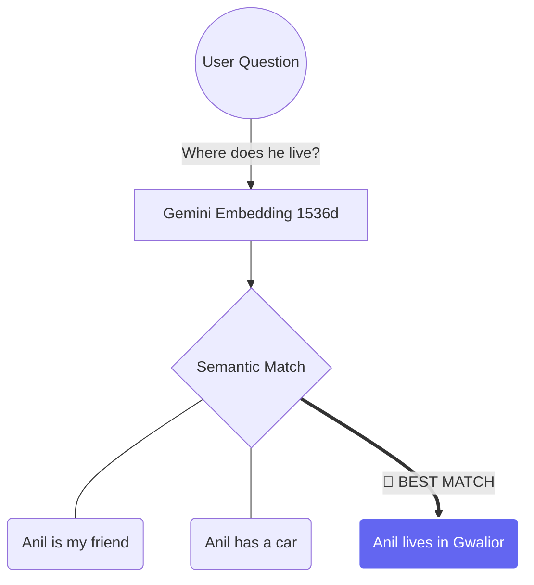

# 🚀 Day 3: Giving AI a "Digital Brain" with EmbeddingEngine 
👉 Live Demo: https://ag3617502.github.io/EmbeddingEngineFE
Welcome to **Day 3** of my AI Learning Journey! Today, things got serious. We moved from simple chat completions to understanding how AI actually "thinks" and "searches" through data.

> "If LLMs are the engine, Embeddings are the map." 🗺️

---

## 🔑 1. The Key to the Kingdom: Gemini API
Before we dive into the math, we need the power. Here’s how I set up my access:
1.  **Visit**: [Google AI Studio](https://aistudio.google.com/) 🛠️
2.  **Auth**: Signed in with my Google account.
3.  **Create**: Clicked **"Get API key"** -> **"Create API key in new project"**.
4.  **Secure**: Saved it in my `.env` file as `GEMINI_API_KEY`. 🔒

---

## 🧠 2. What are Embeddings? (The "Simple" Version)
Imagine you try to explain a **"Golden Retriever"** to a computer. 
A computer doesn't see a furry friend; it sees **Numbers**.

An **Embedding** takes a word and converts it into a long list of coordinates (a vector). 
*   **Dog** 🐕 -> `[0.12, -0.55, 0.88, ...]`
*   **Puppy** 🐶 -> `[0.11, -0.54, 0.87, ...]`
*   **Pizza** 🍕 -> `[0.99, 0.22, -0.11, ...]`

Notice how **Dog** and **Puppy** have very similar numbers? That's because they are semantically close! **Pizza** is far away because, well... you can't pet a pizza. 

---

## 📐 3. The Secret Math: Vectors & Similarity
We used vectors with **1,536 dimensions**. That's basically 1,536 different "traits" the AI uses to describe a word.

To find out which two things match, we use the **Dot Product** (10th Grade Math style!):

$$A \cdot B = (a_1 \times b_1) + (a_2 \times b_2) + (a_3 \times b_3) ...$$

**The bigger the score, the more perfect the match!** ✅

---

## 🏗️ 4. Project Deep-Dive: The "Semantic Matcher"
In this project, I built a system that understands **Context**, not just keywords.

### 🌐 The Architecture
1.  **React Frontend**: A "Glassmorphism" UI where you can add up to 10 sentences.
2.  **Express Backend**: Receives your list and your question.
3.  **Gemini AI**: Converts every single sentence into a 1536-long vector.
4.  **The Processor**: Calculates the similarity score between your question and each sentence.

### 🔄 The Data Flow
```text
[User Inputs]  -> [React App] -> [POST Request] -> [Express Server]
                                                       |
[Best Result] <- [React App] <- [Sorted JSON] <- [Similarity Math]
                                                       |
                                            [Gemini Embedding API]
```

### 🎯 Why is this cool?
If you give it these inputs:
- *"I love coding in JavaScript"*
- *"The sun is very hot today"*
- *"Node.js is great for backends"*

And ask: *"What should I use for my server?"*

The AI knows that **"Node.js"** and **"server"** are related, even though the words are different. It will pick the 3rd option as the best match!

---

## 🌍 5. My Upcoming Journey
This isn't just a small project. This is the **foundation** for:
- **RAG (Retrieval-Augmented Generation)**: Letting AI read books and answer questions.
- **Vector Databases**: Searching through millions of documents in milliseconds.
- **Personal AI Search**: Building a second brain.

---

## 📊 6. Visualizing the Magic



---

### 📬 Follow my Journey!
I'm documenting every step of my AI path. If you're interested in how we go from "Hello World" to "Autonomous Agents", stay tuned! 

**Next Stop: Vector Databases! 🚂💨**
